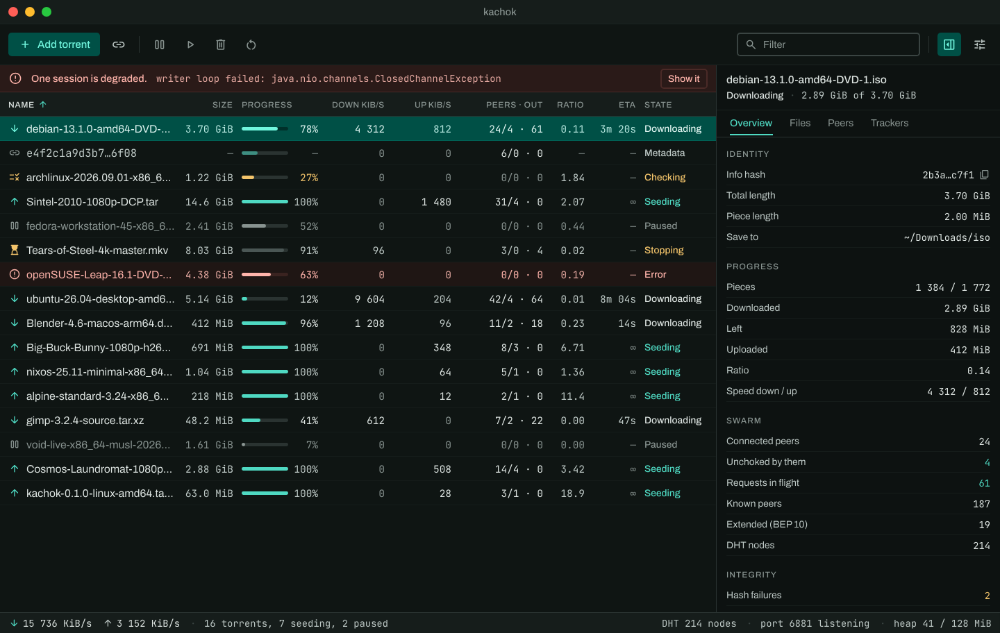

# kachok

A BitTorrent client written in Kotlin — a desktop window, a headless command-line client, and a
Model Context Protocol server, all three on one engine. The engine is common Kotlin: bencode, the
peer wire protocol, piece selection, choking, storage, the DHT. The I/O behind it is whatever the
platform does best; on the desktop that is JDK 25, one virtual thread per peer on a blocking
socket, a pool of 16 KiB direct buffers that travel from the socket to the disk without a copy.



*Not a marketing shot: that is `ui/src/desktopTest/snapshots/main_window.png`, the golden the
screenshot suite compares against, degraded banner and all.*

## What it does

* **Downloads and seeds**, from a `.torrent` or a `magnet:` link, and resumes both across a
  restart — the resume record is an optimisation and the disk is the source of truth.
* **Finds peers four ways**: trackers over HTTP and UDP (BEP 15), the DHT (BEP 5), peer exchange
  (BEP 11) and local discovery — and asks a router to forward its port (UPnP, NAT-PMP).
* **Speaks the extensions a modern swarm expects**: the fast extension (BEP 6), the extension
  protocol (BEP 10), metadata from peers so a magnet becomes a torrent (BEP 9), and IPv6 (BEP 7)
  where the tracker offers it.
* **Lets you choose what arrives and when**: files skipped or raised to the front of the queue,
  sequential download, upload and download limits, pause and re-check.
* **Stays out of the way**: a tray icon, file associations for `.torrent`, a clipboard offer when
  a magnet is on it, and installers for macOS, Windows and Linux.

## Three ways in

**The window** — `./gradlew :ui:run`, or an installer from
`./gradlew :ui:packageDistributionForCurrentOS` (`.dmg`, `.msi`, `.deb`).

**The command line** — a headless client that prints one progress line a second:

```bash
./gradlew :cli:run --args="download ubuntu-26.04-desktop-amd64.iso.torrent --dir ~/Downloads --seed"
```

`./gradlew :cli:runtimeImage` writes a `jlink` image with an ahead-of-time cache — a client that
runs on a machine with no JDK on it.

**An agent** — `kachok mcp` is a Model Context Protocol server on stdin and stdout, JSON-RPC 2.0,
one message per line. It is a third adapter on the same engine rather than a second client: every
tool is a call the window makes too, and the one resource, `kachok://snapshot`, is byte for byte
what the WebSocket sends.

```json
{
  "mcpServers": {
    "kachok": { "command": "kachok", "args": ["mcp", "--dir", "/home/you/Downloads"] }
  }
}
```

| Tool | Does |
|---|---|
| `add_torrent` | a path or a magnet link → started, and the info hash every other tool takes |
| `list_torrents`, `torrent_status` | the list, or one torrent with its files and their tiers |
| `wait_for_completion` | blocks until done, failed, or the timeout — so an agent waits once instead of polling |
| `pause_torrent`, `resume_torrent`, `remove_torrent` | as the toolbar's, with `delete_data` on the last |
| `set_file_priority` | one file to `skip`, `normal` or `high` on a running torrent |

Every refusal is a sentence — which torrent, which path, what was wrong — because the thing on the
other end shows words to a person and has nowhere to look up a code.

## How fast, measured rather than claimed

Same public torrent, same machine, same link, one client at a time, three minutes each, upload
capped at 800 KiB/s on both, on 2026-09-18:

| | kachok | qBittorrent 5.2.1, twice |
|---|---|---|
| downloaded | 3.31 GiB | 3.51 and 3.04 GiB |
| rate | 19.7 MiB/s | 20.0 and 17.3 MiB/s |

Each client's own count of what it downloaded, converted to the same units; the two clients count
*peers* differently enough that comparing those numbers would say more about the counters than
about the clients, so they are not here.

The window runs in a 64 MiB heap; the largest surfaces it holds are Skia's and are not on it. The
figures, the two defects that stood between the first reading and this one, and what still bounds
the rate are in [research D16](docs/research/research-architecture.md) — as is every other number
this project quotes, with where it was taken.

## What it does not do

* **µTP.** Every connection is TCP, and 65 % of dials on a public swarm time out because the peer
  is behind a NAT that only µTP would reach. Deferred with the reasoning in research D14, not
  forgotten.
* **Encrypted connections.** Message Stream Encryption is built, hashed against the right prime
  at last, and proven against a libtorrent client in both directions — and it is not on the live
  connection path yet, so a real download is in the clear (B-100). The zero-copy upload path
  cannot be RC4'd in the kernel, which is why that last step is its own piece of work.
* **Version 2 torrents** (BEP 52), which is still an open question rather than a plan.
* **Android, iOS, and the browser.** The engine is written to be lifted onto them — that is why
  its I/O is behind interfaces — but only the desktop is built.
* **Anything over a network it did not open.** The WebSocket the browser build will use is bound
  to loopback and has no authentication, by decision.

## Build

```bash
./gradlew build          # compile, ktlint, every test; JDK 25 comes from the toolchain
make check               # the documentation gates: the backlog index, the docs, the coverage map
```

## Documentation

[docs/README.md](docs/README.md) is the entry point: the research that says why the engine is
built this way and which claims were verified against what, one document per module, the feature
documents with their scenarios, and [backlog.md](backlog.md) — one file per item, in dependency
order.

## Licence

MIT.
